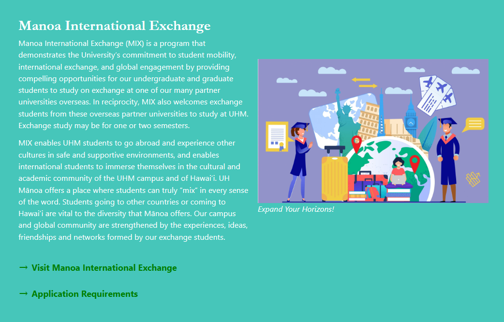
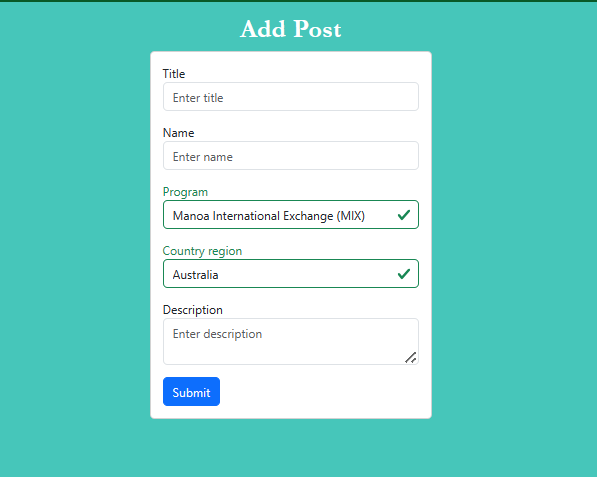
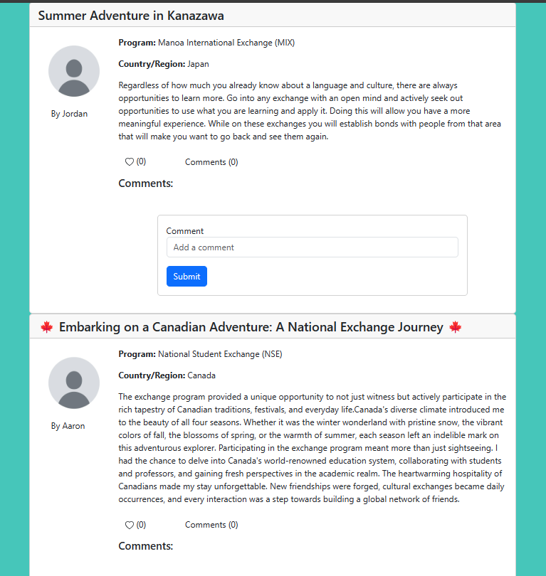

   
  
  

Manoa Study Abroad Central is a web application that my group and I developed for our final project, designed to simplify the process of choosing a study abroad or exchange program at UH Manoa. With numerous programs available, students often face confusion and uncertainty. Our platform offers program overviews, peer testimonials, and interactive features like liking and commenting on posts. Users can search and filter posts by program or region. Additionally, an administration panel allows admins to monitor activity, approve or delete posts, remove comments, and flag posts for a seamless user experience. 

Throughout the project, my responsibilities included setting up the "Add Post" page, deploying the website to Digital Ocean, configuring the domain name and implementing HTTPS for enhanced security. While initially working on the post submission function, I collaborated with a team member, ultimately adopting their code to streamline development. Additionally, I was responsible for implementing TestCafe to conduct automated testing of all web pages, ensuring a smooth and functional user experience. 

To effectively manage our project, we utilized GitHub projects and a branch-based workflow, allowing each team member to focus on specific tasks and later merge their work into the main project. This approach helped us keep track of our progress through a GitHub homepage displaying the latest updates. In terms of resources and skills, we leveraged JavaScript for functionality, ESLint for code quality, IntelliJ for coding, GitHub Desktop for version control, and Meteor and React for web development. These tools and skills were crucial for the project's success. 

In conclusion, our collaborative effort in developing Manoa Study Abroad Central has resulted in a valuable resource for UH Manoa students seeking study abroad and exchange program information. Through effective project management, skillful use of development tools, and a commitment to user-friendly design, we have created a platform that simplifies the process of selecting the right program. By offering program overviews, peer testimonials, and an administrative system, we aim to empower students with the knowledge and confidence to make informed decisions about their international educational experiences. This project has not only enhanced our technical skills but also highlighted the importance of teamwork and user-centric design in software development. 

<a href="https://manoa-study-abroad-central.github.io/">Project Homepage</a>

<a href="https://github.com/manoa-study-abroad-central/manoa-study-abroad-central">GitHub Organization</a>

