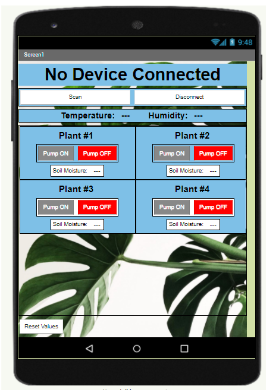

   
  
  

My team designed a watering system using an Arduino Uno microcontroller, which was controlled by an app created using the online platform MIT App Inventor 2. The app monitored temperature, humidity, and soil moisture values, while also controlling the watering pumps for up to four plants. Users could configure the device to automatically water their plants when the soil moisture level dropped below a certain point, or they could manually activate the water pumps through the app. 

My specific role in this project was to assemble the device, wire the components together, and to design the app. I also had to collaborate closely with team members to ensure seamless integration of hardware and software components for our Automated Watering System project.
